<h1 align="center">Fala aí 👋, eu sou o Gabriel</h1>

<p align="center">
  💻 Estudante de Engenharia de Software <br/>
  🚀 Focado em Back-end, APIs e desenvolvimento Full Stack <br/>
  ⚡ Sempre buscando evoluir e construir projetos reais
</p>

<p align="center">
  
</p>

---

## 📊 Estatísticas

<div align="center">
  
</div>

---

## 🐍 Contribuições

<picture>
  <source media="(prefers-color-scheme: dark)" srcset="https://raw.githubusercontent.com/gabbzin/gabbzin/output/github-contribution-grid-snake-dark.svg">
  <source media="(prefers-color-scheme: light)" srcset="https://raw.githubusercontent.com/gabbzin/gabbzin/output/github-contribution-grid-snake.svg">
  
</picture>

---

## 📟 Wakatime Stats

<!--START_SECTION:waka-->

```txt
From: 10 February 2026 - To: 14 June 2026

Total Time: 166 hrs

TypeScript     132 hrs 8 mins        ███████████████████▓░░░░░   78.74 %
Prisma         8 hrs 24 mins         █▒░░░░░░░░░░░░░░░░░░░░░░░   05.02 %
Markdown       5 hrs 31 mins         ▓░░░░░░░░░░░░░░░░░░░░░░░░   03.29 %
PHP            3 hrs 1 min           ▒░░░░░░░░░░░░░░░░░░░░░░░░   01.80 %
Bash           2 hrs 11 mins         ▒░░░░░░░░░░░░░░░░░░░░░░░░   01.31 %
TSConfig       1 hr 54 mins          ▒░░░░░░░░░░░░░░░░░░░░░░░░   01.14 %
Other          1 hr 48 mins          ▒░░░░░░░░░░░░░░░░░░░░░░░░   01.08 %
```

<!--END_SECTION:waka-->

<!--## 🧮 Métricas-->

<!--  -->

---

## 🚀 Tecnologias

<p align="center">
  
</p>

---

## 🌐 Redes sociais

<p align="center">
  <a href="https://www.instagram.com/gabb.zin_/">
    
  </a>
</p>

---


